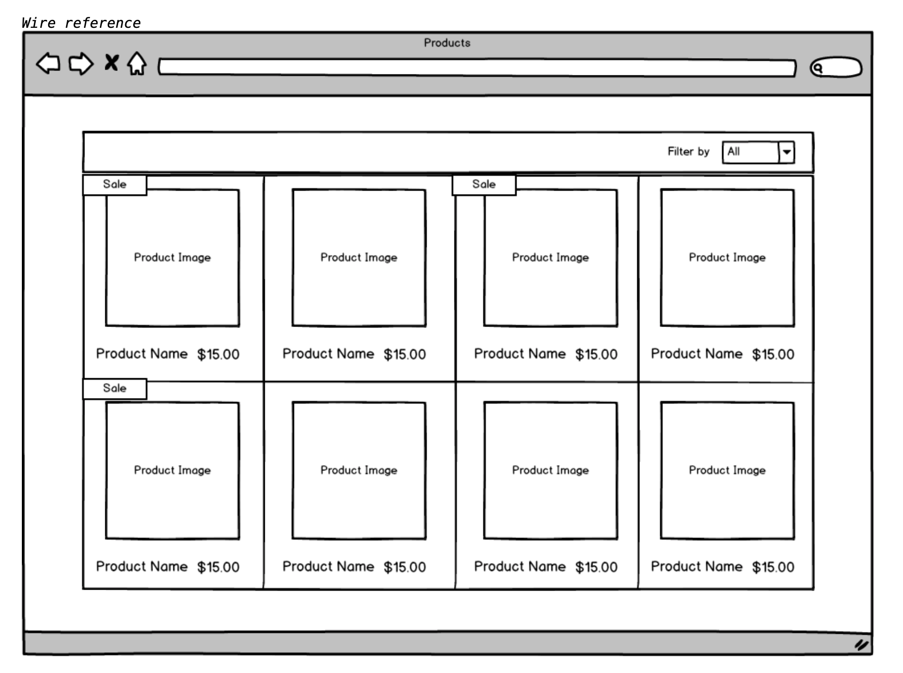

# Commerce Product Listing 🍺

#### Technologies: React, HTML, CSS

[Task](#Task) | [Setup](#Setup) | [Acceptance Criteria](#Acceptance_Criteria) | [Wire Reference](#Wire_Reference) | [Further improvements](#Further_Improvements)


## <a name="Task">The Task</a>

We have a simple products JSON array. We would like you to read the array and display it in an organized way. Included is the data file and images, also find a file with a rough wireframe of how the end product should look.

## <a name="Setup">Setup</a>

First, clone this repository. Then:

```
> npm install # Get dependencies
> npm start # Build and serve the application on `localhost:3000`
```
To run tests:
```
> npm test # Run the tests
```

## <a name="Acceptance_Criteria">Acceptance Criteria</a>

Requirements:
- Build with MV* framework
- Read data from JSON
- Responsive Layout
- Display product image, name and price.
- Build dropdown filters for product type
- Hide and show data depending on the dropdown filters • Show an indicator on the product if it is on sale.
- Simple open text filter (search).

Don't forget:

- The page should be responsive and that it displays elegantly on mobile through to desktop.
- Create a GitHub or Bitbucket repository and commit your work to this repository.
- Please refrain from committing all your code in one go as we would like to see a logical commit pattern as you create your solution, and your GIT comment practices.
- Please surround your code with a few basic unit tests, the tests don’t need to be super granular but do write tests for all logical functionalities.
- Include a Readme of how to use your repository.

## <a name="Wire_Reference">Wire Reference</a>



## <a name="Further_Improvements">Further Improvements</a>

If I was writing this code for production I'd take the following further actions:

- Obtain pixel accurate wireframes from the UX team, especially for responsive views;
- Write a flex-fallback into the CSS to ensure maximum browser support;
- Seek further guidance from the project owner/manager about the filter functionality e.g. should filtered results be searchable? Should search results be filterable? 
- Make further design decisions based on how to fetch cars from an external API e.g. factoring in async calls and the size of responses;
- Write more tests to improve coverage.


