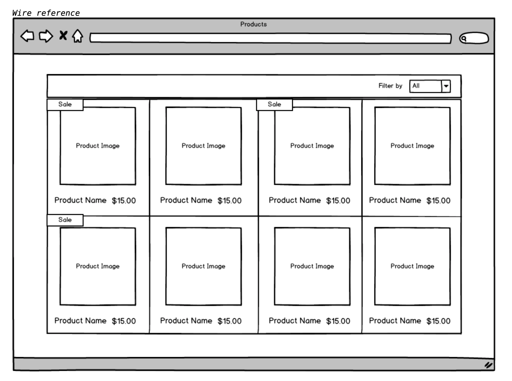

# Commerce Product Listing

## Setup
Run `npm i` to get the dependencies

Run `npm start` to build and serve the application on `localhost:3000`

## Testing
Run `npm test` to run tests

## Design

## Accecptance Criteria

We have a simple products JSON array. We would like you to read the array and display it in an organized way. Included is the data file and images, also find a file with a rough wireframe of how the end product should look.

Requirements:
• Build with MV* framework
• Read data from JSON
• Responsive Layout
• Display product image, name and price.
• Build dropdown filters for product type
• Hide and show data depending on the dropdown filters • Show an indicator on the product if it is on sale.
• Simple open text filter (search).

Don't forget:

- The page should be responsive and that it displays elegantly on mobile through to desktop.
- Create a GitHub or Bitbucket repository and commit your work to this repository.
- Please refrain from committing all your code in one go as we would like to see a logical commit pattern as you create your solution, and your GIT comment practices.
- Please surround your code with a few basic unit tests, the tests don’t need to be super granular but do write tests for all logical functionalities.
- Include a Readme of how to use your repository.

